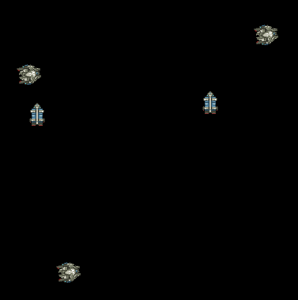

# Traders
A spaceship trading simulator based on the Amethyst Rust game engine. Purely as a hobby project.

## Roadmap

### Rendering / UI
- [x] Render ships and stations
- [ ] Show debug information like current cargo, speed, heading, etc.
- [ ] Camera panning and zooming
- [x] Follow an entity with camera

### Simulation
- [x] Have some sort of movement
- [ ] Implement ship rotation and main engine axis firing
- [ ] Station production of a resource
- [ ] Loading/unloading of cargo
- [ ] Pick next ship destination based on needs or cargo
- [ ] Currency and purchasing/selling of goods
- [ ] Mining of raw resources from asteroids/nebula
- [ ] Construction of new ships from goods
- [ ] Construction of new stations from goods